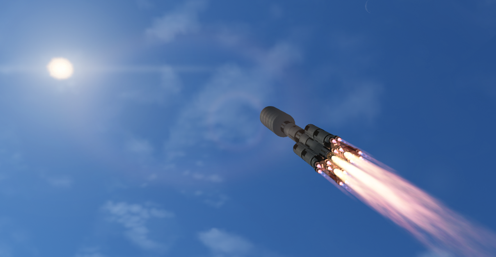
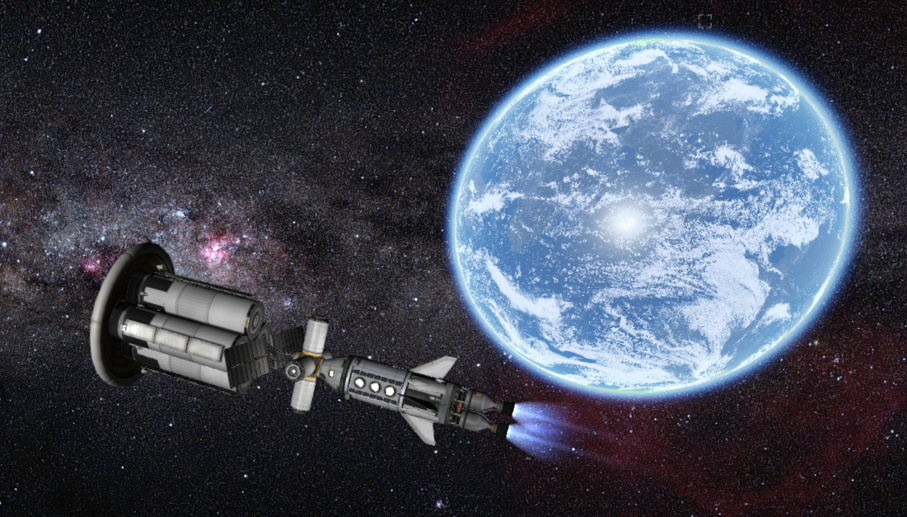
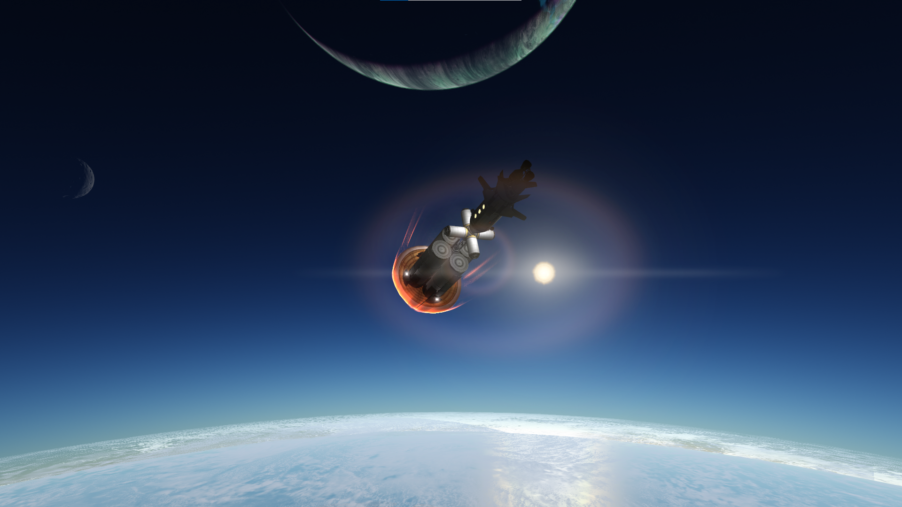
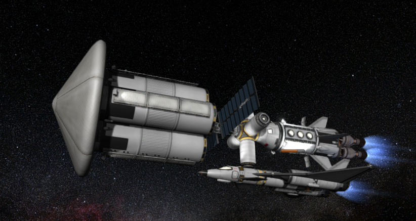

# 工程设想[在建]

## 1. FusionOS
一种假想的可以兼容全平台的操作系统，同时兼容Windows, Linux, macOS, Android, iOS, FreeBSD......

## 2. 微立方模块化芯片制造
一种假想的芯片制造方法，通过制造无数基本立方电路元件，像搭积木一样把元件粘合在一块，从而在三维空间内制造电路

## 3. 处理器冗余加速
一种假想的处理器加速方法，通过降压升频用稳定性换性能，再用多组处理器或多个核心互相纠错补偿稳定性

## 4. 气垫球
一个像气垫导轨像各个方向喷气的球，可以依赖地面效应悬浮于地面，有奇特的受力反馈，非常好玩。

## 5. 同温层天文/大气观测站
一个假想的项目，通过微型飞艇携带望远镜、气压仪、星链天线、太阳能板、涵道风扇等设备至平流层，从而得以长期停留于平流层并进行星空和云层观测

## 6. “曙光号”多用途飞船

一艘配备有[星辰推进器](#星辰推进器)，具有流线型外形的小型载人飞船，能轻易在银河系内以1g左右的加速度自由地航行，加速到接近光速，造访各个行星。这个项目的目的在于在科学允许的前提下实现小时候曾经对于太空旅行和飞船的最为纯粹的梦想。

## 7. 风灵号轨道器
一艘我在[坎巴拉太空计划(KSP)](https://baike.baidu.com/item/%E5%9D%8E%E5%B7%B4%E6%8B%89%E5%A4%AA%E7%A9%BA%E8%AE%A1%E5%88%92/7596160?fr=aladdin)中设计的有趣的飞船，可以通过大气制动节省燃料

   

    
        
       
发射载具

   

   

       
        
       
飞跃Kerbin

   

    
     
    
大气制动

   

    
     
    
携带Aeris4A核动力改进型太空飞机

## 8. 土星滑翔机
一种假想的可以稳定在气态行星低层大气低速巡航的太空飞机，可以帮助拍摄土星夜间极其壮观的图片

## 9. 可扩展性医用机械外骨骼
一种用于医疗辅助的微型机械外骨骼

## 10. 生物分子电力供能器
一种假想的用电能维持人体生物循环的设备

## 11. 通用纳米技术核心模块
一种假想的高级文明用来组成科技设备的基本单位，可以自由地进行编程和重组从而从而将一种科技转为另一种科技

## 12. 微型惰性气体托卡马克模拟装置
一个装有电磁线圈的托卡马克模型，内部充有惰性气体，在运行时可以观察到惰性气体通电发光和被约束的过程

## 13. 小型飞船缆绳式人工重力解决方案
用缆绳和可分离配重块最大化飞船居住舱和重心的距离，从而使小型飞船可以实现人工重力

## 14. 相对论性μ子存储线圈
通过将μ子加速到接近光速从而延长其衰变所需要的时间，进而实现μ子长时间存储从而实现μ子催化聚变

## 15. 根式单向加密
由考试用991计算器猜答案的过程可知，如果对一个数进行含有加减乘除和开根的运算，很难猜出原数是什么，因此这个原理可用于加密

## 16. 电磁雨伞
一个神奇的没有伞面的微型雨伞，原理类似[巴萨德冲压发动机](#巴萨德冲压发动机)，可以发射激光等离子化雨滴并用磁场将其偏转，从而阻止伞下的人淋到雨

## 17. 蚊虫点防御
运用三维成像系统和大功率激光，从而高效击落那些尝试在你大腿上进行俯冲轰炸的蚊子

## 18. 开源物理可视化框架(Open Physics Visualization Framework, OPVF)
一个开源物理引擎计划，旨在渲染出符合物理的图像和结构，从而用于科幻作品
