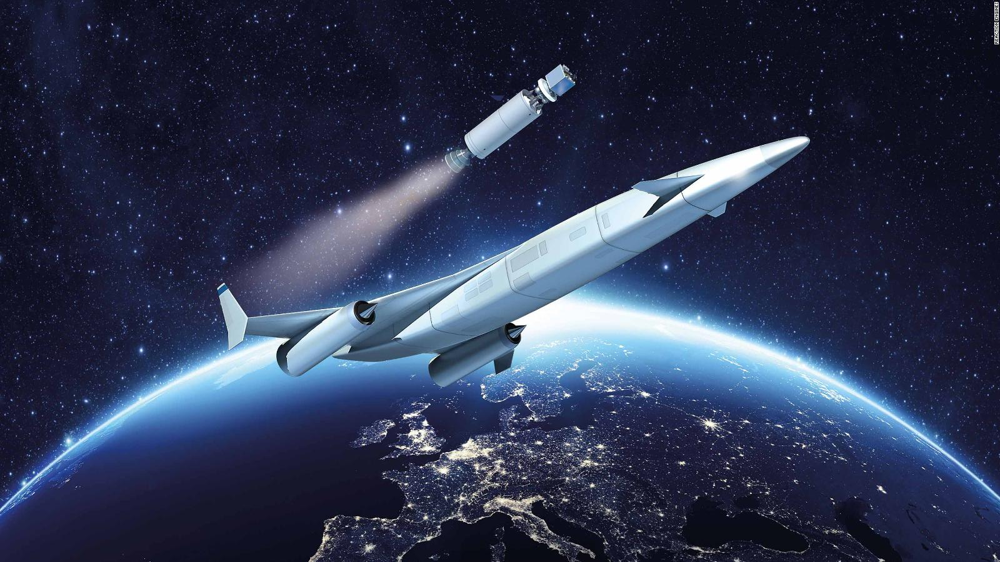
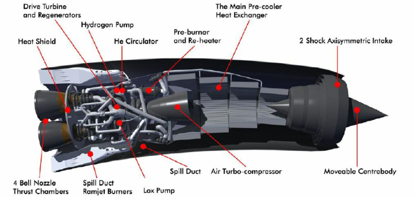
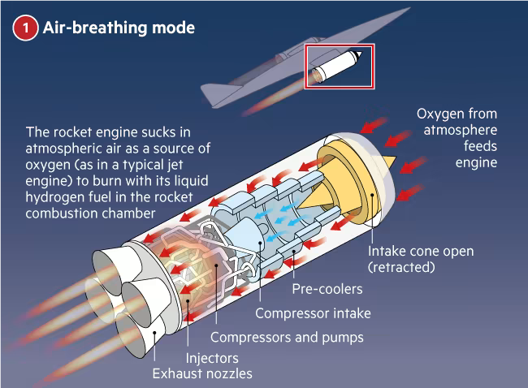
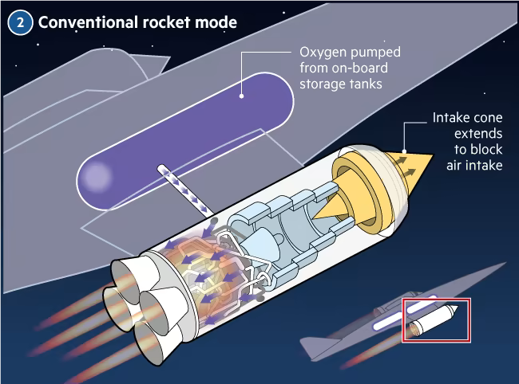
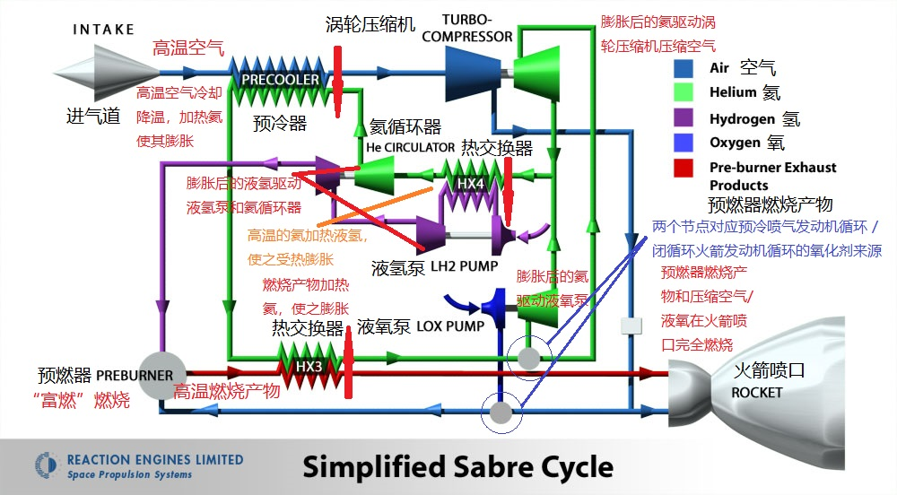

# 推进装置[在建]

## 1. **化学火箭**
| **来源** | ** *现实世界*  - 已广泛运用科技** |
| -------- | ------------------------------------------------------------ |
| **类别** | ***宇航推进* - 化学能推进器**                                |

低比冲大推力的化学动力火箭，适用于飞船进入轨道的发射阶段，*500s<Isp<700s*

## 2. **离子推进器**

| **来源** | ** *科技运用*  - 不成熟科技** |
| -------- | -------------------------------------------------------- |
| **类别** | ***宇航推进* - 通用供能推进器**                          |

低推力高比冲推进器，包括胶质发动机、霍尔效应推进器和VASIMR等推进器，*1000s<Isp<30000s*([百度百科](https://baike.baidu.com/item/%E7%A6%BB%E5%AD%90%E6%8E%A8%E8%BF%9B%E5%99%A8/4751870?fr=aladdin)\|[Wikipedia](https://en.wikipedia.org/wiki/Ion_thruster))

## 3. **协同吸气式火箭发动机(SABRE)**
| **来源**         | ** *科学研究*  - Reaction Engines** |
| ---------------- | ------------------------------------------------------------ |
| **类别**         | ***宇航推进* - 化学能推进器**                                |
| 循环方式         | 预冷喷气发动机循环 + 闭循环火箭发动机循环                    |
| 化学火箭循环类型 | 膨胀循环 + 分级燃烧循环                                      |
| 推进剂           | 空气 / 液氧 + 液氢                                           |
| 推力(真空)       | 2,940 kN                                                     |
| 推力(海平面)     | 1,960 kN                                                     |
| 推重比           | 可达 14 (大气层内)                                           |
| 比冲(真空)       | 460 s (4.5 km/s)                                             |
| 比冲(海平面)     | 3,600 s (35 km/s)                                            |
| 上游地址         | [Reaction Engines 官网](https://www.reactionengines.co.uk/sabre) |
| See also         | [百度百科](https://baike.baidu.com/item/佩刀吸气式火箭发动机/15639055?fr=aladdin)\|[Wikipedia](https://en.wikipedia.org/wiki/SABRE_(rocket_engine))\|视频：[【航天前沿｜英国云霄塔空天飞机】]( https://www.bilibili.com/video/BV1bs41117m1?share_source=copy_web&vd_source=11282ef3a1c01db366957466675641af) |

**SABRE**是英国*反应引擎公司(Reaction Engines)*正在研发的一款发动机，用于[云霄塔太空飞机(Skylon)](https://baike.baidu.com/item/%E4%BA%91%E9%9C%84%E5%A1%94/16402021?fr=aladdin)。它可以在大气层吸入空气作为氧化剂加速至5马赫，然后切换至火箭模式加速至25马赫进入近地轨道。

相比传统火箭引擎，SABRE在飞行初期在大气中获取氧气作为氧化剂，从而大幅减少太空飞机携带的氧化剂，实现单级入轨和整体回收。

由于云霄塔完全可回收，它有潜力成为近未来人类大规模往返近地轨道的理想工具。

 
     
    
云霄塔空天飞机

**SABRE**是实现云霄塔空天飞机的关键技术，也是其最大的技术难题。

 
     
    
SABRE3 - 上一代SABRE设计    Credit: Reaction Engines

 
     
    
SABRE4 - 一个可扩展的设计方案    Credit: Reaction Engines

以下是对SABRE的原理解释：

 
     
    
SABRE预冷喷气发动机循环    Credit: FT

 
     
    
SABRE闭循环火箭发动机循环    Credit: FT

 
     
    
SABRE原理图    Credit: Reaction Engines

## 4. **超导电磁流体推进器**

在导电流体中通过安培力作用产生推力

## 5. **蒸汽-流体混合推进器**
类似喷气发动机，通过加热流体至沸腾，产生大量气体，对外膨胀产生推力

## 6. **非常规高效化学推进器**

临界态金属氢/自由基结合/亚稳态原子推进器，*1700s<Isp<4300s*([Atomic Rockets](http://www.projectrho.com/public_html/rocket/enginelist.php#atomichydrogen))

## 7. **核能航空发动机**
利用裂变反应堆加热空气使之膨胀产生推力([百度百科](https://baike.baidu.com/item/%E6%A0%B8%E8%83%BD%E8%88%AA%E7%A9%BA%E5%8F%91%E5%8A%A8%E6%9C%BA/22108579?fr=aladdin))

## 8. **核热火箭(NTR)**

| **来源** | ** *科技运用*  - 已测试科技** |
| -------- | -------------------------------------------------------- |
| **类别** | ***宇航推进* - 原子能推进器**                            |

利用裂变反应堆加热工质使之膨胀产生推力([Atomic Rockets](http://www.projectrho.com/public_html/rocket/engineintro.php)\|[Wikipedia](https://en.wikipedia.org/wiki/Nuclear_thermal_rocket))

### 1. **固态核心**

| **来源** | ** *科技运用*  - 美国NERVA核火箭计划** |
| -------- | ------------------------------------------------------------ |
| **类别** | ***宇航推进* - 原子能推进器**                                |
| See also | [百度百科](https://baike.baidu.com/item/NERVA/4210615?fr=aladdin)\|[Atomic Rockets](http://www.projectrho.com/public_html/rocket/enginelist2.php#ntrsolidcore)\|[Wikipedia](https://en.wikipedia.org/wiki/Nuclear_thermal_rocket#Solid_core) |

裂变物质维持固态，效率大概为化学火箭的2-4倍，NERVA，*800s(H2)<Isp<1600s(H1)()

### 2. **脉冲核热火箭**

通过脉冲获得比固态核心更高的效率，[Wikipedia](https://en.wikipedia.org/wiki/Nuclear_thermal_rocket#Pulsed_nuclear_thermal_rocket)

### 3. **液态核心**

裂变物质处于液态，效率高于固态核心，*1300s<Isp<1500s*([Wikipedia](https://en.wikipedia.org/wiki/Nuclear_thermal_rocket#Liquid_core))

### 4. **气态核心**

裂变物质以等离子态形式加热工质([Atomic Rockets](http://www.projectrho.com/public_html/rocket/enginelist2.php#basicgcr)\|[Wikipedia](https://en.wikipedia.org/wiki/Nuclear_thermal_rocket#Liquid_core))

#### 1. **开式循环(Open Cycle)**

比冲高，但裂变物质混入喷流，喷流带放射性，*3568s<Isp<9990s*([Atomic Rockets](http://www.projectrho.com/public_html/rocket/enginelist2.php#ntrgasopen))

#### 2. **闭式循环(Closed Cycle)**

裂变物质被约束，喷流带很少放射性，但比冲只有开式循环的一半，Lightbulb，*2080s<Isp<3140s*([Atomic Rockets](http://www.projectrho.com/public_html/rocket/enginelist2.php#ntrgasclosed))

## 9. **核脉冲推进器**

用原子弹或核弹的爆炸提供脉冲推力([Wikipedia](https://en.wikipedia.org/wiki/Nuclear_pulse_propulsion))

### 1. **猎户座计划(Orion)**

| **来源** | ** *科学研究*  - 美国猎户座计划** |
| -------- | ------------------------------------------------------------ |
| **类别** | ***宇航推进* - 原子能推进器**                                |

在船尾投下核弹，经缓冲后脉冲推进，*4383s(裂变)<Isp<12000s(聚变)*([Atomic Rockets](http://www.projectrho.com/public_html/rocket/enginelist3.php#boomboom)\|[Wikipedia](https://en.wikipedia.org/wiki/Project_Orion_(nuclear_propulsion)))

### 2. **美杜莎(Medusa)**

| **来源** | ** *科学研究*  - ** |
| -------- | ---------------------------------------------- |
| **类别** | ***宇航推进* - 原子能推进器**                  |

在船头引爆核弹，用一个巨大的伞承受核弹爆炸的能量，*49000s<Isp<98000s*([Atomic Rockets](http://www.projectrho.com/public_html/rocket/enginelist3.php#medusa)\|[Wikipedia](https://en.wikipedia.org/wiki/Nuclear_pulse_propulsion#MEDUSA))

## 10. **协同吸气式核热火箭发动机**

| **来源** | ** *科技融合*  - [SABRE](SABRE) + [核热火箭](NTR)** |
| -------- | ------------------------------------------------------------ |
| **类别** | ***航空推进* - 原子能推进器**                                |

把[核能航空发电机](#核能航空发动机)和[NTR](#NTR)以[SABRE](#SABRE)的方式集成，从而制成更加高效的核动力SABRE

## 11. **核盐水火箭(NSWR)**

| **来源** | ** *科学研究*  - 前沿科技**       |
| -------- | ------------------------------------------------------------ |
| **类别** | ***宇航推进* - 原子能推进器**                                |
| See also | [百度百科](https://baike.baidu.com/item/%E6%A0%B8%E7%9B%90%E6%B0%B4%E7%81%AB%E7%AE%AD/22755969?fr=aladdin)\|[Atomic Rockets](http://www.projectrho.com/public_html/rocket/enginelist2.php#nswr)\|[Wikipedia](https://en.wikipedia.org/wiki/Nuclear_salt-water_rocket) |

用溶解于水中的核燃料进行推进，运行方式介于核反应堆和核弹之间，相当于一个持续反应的猎户座核脉冲推进器，*6728s<Isp<0.016c/g*

## 12. **核裂变碎片火箭发动机(FFRE)**

| **来源** | ** *科学研究*  - 前沿科技**       |
| -------- | ------------------------------------------------------------ |
| **类别** | ***宇航推进* - 原子能推进器**                                |
| See also | [Atomic Rockets](http://www.projectrho.com/public_html/rocket/enginelist2.php#fissionfragment)\|[Wikipedia](https://en.wikipedia.org/wiki/Fission-fragment_rocket) |

运用核反应产物碎片作为喷流，完全无需外带工质，*Isp<0.03c/g*

## 13. **无扇叶电等离子体航空发动机**

| **来源** | ** *科技融合*  - 电等离子体航空发动机 + 离子推进飞机** |
| -------- | ------------------------------------------------------------ |
| **类别** | ***航空推进* - 通用供能推进器**                              |
| See also | [电等离子体航空发动机 - 论文](https://aip.scitation.org/doi/10.1063/5.0005814)\|[离子推进飞机 - Wikipedia](https://en.wikipedia.org/wiki/Ion-propelled_aircraft) |

用强电场电离并推动空气，通过静态压气机压缩空气，并用大功率微波加热空气至等离子态，最后在电磁线圈的引导下喷出产生推力

## 14. **协同吸气式可变比冲电磁等离子体火箭推进器**

| **来源** | ** *科技融合*  - [SABRE](SABRE) + [无扇叶电等离子体航空发动机](无扇叶电等离子体航空发动机) + [VASIMR](VASIMR)** |
| -------- | ------------------------------------------------------------ |
| **类别** | ***航空推进* - 通用供能推进器**                              |

把[无扇叶电等离子体航空发动机](#无扇叶电等离子体航空发动机)和[VASIMR](#离子推进器)以[SABRE](#SABRE)的方式集成，从而制成更加高效的电等离子体SABRE

## 15. **核聚变推进器**

| **来源** | ** *科学研究*  - 广泛科学研究**   |
| -------- | ------------------------------------------------------------ |
| **类别** | ***宇航推进* - 核聚变推进器**                                |
| See also | [百度百科](https://baike.baidu.com/item/%E6%A0%B8%E8%81%9A%E5%8F%98%E5%8A%A8%E5%8A%9B%E7%81%AB%E7%AE%AD/5927765?fr=aladdin)\|[Atomic Rockets](http://www.projectrho.com/public_html/rocket/realdesignsfusion.php)\|[Wikipedia](https://en.wikipedia.org/wiki/Fusion_rocket) |

通过聚变反应等离子体喷流提供推力

### 1. **磁约束核聚变**

*6809s(D-T Tokamak)<Isp<199796s(线性聚变)*([Atomic Rockets](http://www.projectrho.com/public_html/rocket/enginelist3.php#toroidalfusion)\|[Wikipedia](https://en.wikipedia.org/wiki/Fusion_rocket#Magnetic))

### 2. **Z箍缩**

*132500s<Isp<0.012c/g*([Atomic Rockets](http://www.projectrho.com/public_html/rocket/enginelist3.php#fszpinch))

### 3. **惯性约束核聚变**

用激光和弹丸自身惯性的推进器，代达罗斯计划，*17329s(VISTA)<Isp<0.035c/g(P-P Fusion)*([Atomic Rockets](http://www.projectrho.com/public_html/rocket/enginelist3.php#icfusion)\|[Wikipeida](https://en.wikipedia.org/wiki/Fusion_rocket#Inertial))

### 4. **磁-惯性约束核聚变**

结合了磁约束和惯性核聚变的推进器，*Isp-min=5000s, 50000s<Isp<100000s*([Atomic Rockets](http://www.projectrho.com/public_html/rocket/enginelist3.php#mif)\|[Wikipedia](https://en.wikipedia.org/wiki/Fusion_rocket#Magnetized_target))

### 5. **μ子催化聚变推进器**

在热核聚变小型化前用于小型飞船的聚变推进器

### 6. **质子聚变/重核聚变/梯级核能推进器**

非常规核聚变推进器，*Isp<0.14c/g*

## 16. **外燃式电磁等离子体推进器构型**

| **来源** | ** *想象* ** |
| -------- | ---------------------------------------- |
| **类别** | ***宇航推进* - 通用供能推进器**          |

完全运用电磁场在飞船外对燃料和反应进行操纵，将反应过程完全置于飞船外，通过喷流等离子体与电磁场的作用推动飞船前进。可以避开材料限制，获得极大的功率。这种构型的推进器在运行时看上去就像魔法一样。

## 17. **夸克聚变推进器**

| **来源** | ** *边缘科学*  - [夸克聚变引擎(Sphalerizer)](./Power#夸克聚变引擎)**] |
| -------- | ------------------------------------------------------------ |
| **类别** | ***宇航推进* - 通用供能推进器**                              |

利用[夸克聚变引擎](#夸克聚变引擎)能量的推进器，*Isp=0.85c/g*

## 18. **微型黑洞火箭推进器**
利用微型黑洞特性进行高效宇航推进

### 1. **霍金辐射型**

| **来源** | ** *边缘科学*  - 黑洞星舰**        |
| -------- | ------------------------------------------------------------ |
| **类别** | ***宇航推进* - 黑洞推进器**                                  |
| See also | [Atomic Rockets](http://www.projectrho.com/public_html/rocket/slowerlight3.php#blackhole)\|[Wikipedia](https://en.wikipedia.org/wiki/Black_hole_starship) |

*0.2c/g<Isp<0.9c/g*

### 2. **能层工质加速/光子变频型**

| **来源** | ** *想象* ** |
| -------- | ---------------------------------------- |
| **类别** | ***宇航推进* - 黑洞推进器**              |

利用[彭罗斯过程](彭罗斯过程)提高光子频率

### 3. **类星体喷流型**

| **来源** | ** *想象* ** |
| -------- | ---------------------------------------- |
| **类别** | ***宇航推进* - 黑洞推进器**              |

利用引力势能，喷流和吸积盘热辐射

### 4. **混合型**

| **来源** | ** *科技融合*  - 霍金辐射型 + 能层工质加速/光子变频型 + 类星体喷流型** |
| -------- | ------------------------------------------------------------ |
| **类别** | ***宇航推进* - 黑洞推进器**                                  |

同时或分别使用上述三种推进方式

## 19. **反物质推进器**
利用正反物质湮灭的推进方式([百度百科](https://baike.baidu.com/item/%E5%8F%8D%E7%89%A9%E8%B4%A8%E6%8E%A8%E8%BF%9B%E5%99%A8/2623996?fr=aladdin)\|[Atomic Rockets](http://www.projectrho.com/public_html/rocket/enginelist3.php#antirocket)\|[Wikipedia](https://en.wikipedia.org/wiki/Antimatter_rocket))

### 1. **π介子工质推进型(粒子束核心，Beam Core)**
(*Isp=0.3c/g*)([Atomic Rockets](http://www.projectrho.com/public_html/rocket/enginelist3.php#ambeam)\|[Wikipedia](https://en.wikipedia.org/wiki/Antimatter_rocket#Pure_antimatter_rocket:_direct_use_of_reaction_products))
### 2. **纯光子推进型(激光核心，Laser Core)**
(*Isp=1c/g*)([Atomic Rockets](http://www.projectrho.com/public_html/rocket/enginelist3.php#amlaser))

## 20. **光子推进器**
(*Isp=1c/g*)

## 1. **纯质能转化光子火箭推进器**

## 2. 

## 3. 

## 21. **光帆**
反射太阳光子，依赖光压产生推力([百度百科](https://baike.baidu.com/item/%E5%85%89%E5%B8%86%E6%8A%80%E6%9C%AF/19583150?fr=aladdin)\|[Atomic Rockets](http://www.projectrho.com/public_html/rocket/enginelist.php#photonsail)\|[Wikipedia](https://en.wikipedia.org/wiki/Solar_sail))

## 22. **电帆(E-sail, Electric solar wind sail)**
通过电场偏转太阳风质子获得动量([百度百科](https://baike.baidu.com/item/%E7%94%B5%E5%B8%86/15721000?fr=aladdin)\|[Atomic Rockets](http://www.projectrho.com/public_html/rocket/enginelist.php#esail)\|[Wikipedia](https://en.wikipedia.org/wiki/Electric_sail))

## 23. **巴萨德冲压发动机**
通过超导线圈产生巨大的磁场并用激光束等离子化星际物质，在航行中获取星际物质作为燃料，实现持续不断的加速，从而获得接近光速的飞行速度([百度百科](https://baike.baidu.com/item/%E6%98%9F%E9%99%85%E5%86%B2%E5%8E%8B%E5%8F%91%E5%8A%A8%E6%9C%BA/1367926?fr=aladdin)\|[Atomic Rockets](http://www.projectrho.com/public_html/rocket/slowerlight3.php#bussard)\|[Wikipedia](https://en.wikipedia.org/wiki/Bussard_ramjet))

### 1. **磁帆(Magnetic Sail)**

用超导线圈产生巨大的磁场最大化星际物质或太阳风对飞船的作用力，从而不用使用自带燃料进行加速，减速，或是航行控制([百度百科](https://baike.baidu.com/item/%E7%A3%81%E5%9C%BA%E5%B8%86/5928203?fr=aladdin)\|[Wikipedia](https://en.wikipedia.org/wiki/Magnetic_sail))

#### 1. **磁帆航行控制系统**

一个用于装有磁帆飞船的空间航行控制系统，使无动力飞船得以只运用星际物质作用力到达目的地，或是作为普通飞船的紧急控制系统，帮助其在主引擎失效时改变航向飞往最近的星系

#### 2. **矢量磁帆**

物质进口和喷流方向可以由0°-180°变化的磁帆，有着理论上最大的磁帆航行控制能力

### 2. **电磁等离子体工质反向推力**

使基于[巴萨德冲压发动机](#巴萨德冲压发动机)的推进器在减速过程中通过磁场使等离子体在离开喷口后反向喷出，从而使飞船同时利用[磁帆](#磁帆)和推进器推力，从而获得最大减速推力

### 3. **抛面镜光子反向推力**

类似[电磁等离子体工质反向推力](#电磁等离子体工质反向推力)，通过反射推进器光子喷流获得反推力

### 4. **同轴反转静电磁场发生器**

运用同轴反转驱动带有同量正负电荷的环形结构产生强大的磁场

### 5. **环形等离子磁场发生器**

利用一些电磁部件加速等离子体使之在飞船周围高速运动，产生强大的磁场

## 24. **星辰推进器(Star Drive)**

| **来源** | ** *科技融合*  - [超导电磁流体推进器](#超导电磁流体推进器) + [蒸汽-流体混合推进器](#蒸汽-流体混合推进器) + [协同吸气式可变比冲电磁等离子体火箭推进器](#协同吸气式可变比冲电磁等离子体火箭推进器) + [纯质能转化引擎](#纯质能转化引擎) + [巴萨德冲压发动机](#巴萨德冲压发动机) + [电磁等离子体工质反向推力](#电磁等离子体工质反向推力) + [抛面镜光子反向推力](#抛面镜光子反向推力)** |
| -------- | ------------------------------------------------------------ |
| **类别** | ***宇航推进* - 纯质能转化推进器**                            |

一种集成了[超导电磁流体推进器](#超导电磁流体推进器)、[蒸汽-流体混合推进器](#蒸汽-流体混合推进器)、[协同吸气式可变比冲电磁等离子体火箭推进器](#协同吸气式可变比冲电磁等离子体火箭推进器)、[纯质能转化光子火箭推进器](#纯质能转化引擎)和[巴萨德冲压发动机](#巴萨德冲压发动机)，配备有[电磁等离子体工质反向推力](#电磁等离子体工质反向推力)和[抛面镜光子反向推力](#抛面镜光子反向推力)，具有调整质量-能量比例改变比冲能力的推进器，可以使飞船高效地实行行星流体/行星大气/行星际/恒星际/跨星系航行，*3000s<Isp<1c/g*

