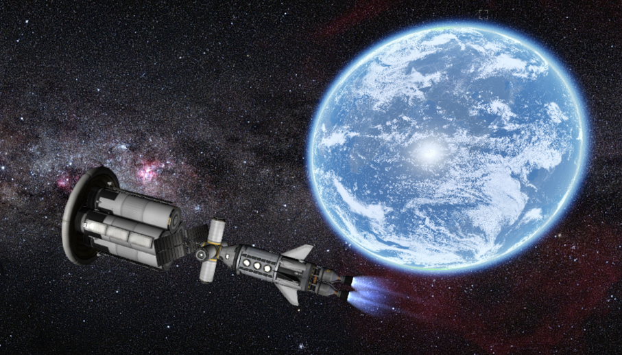
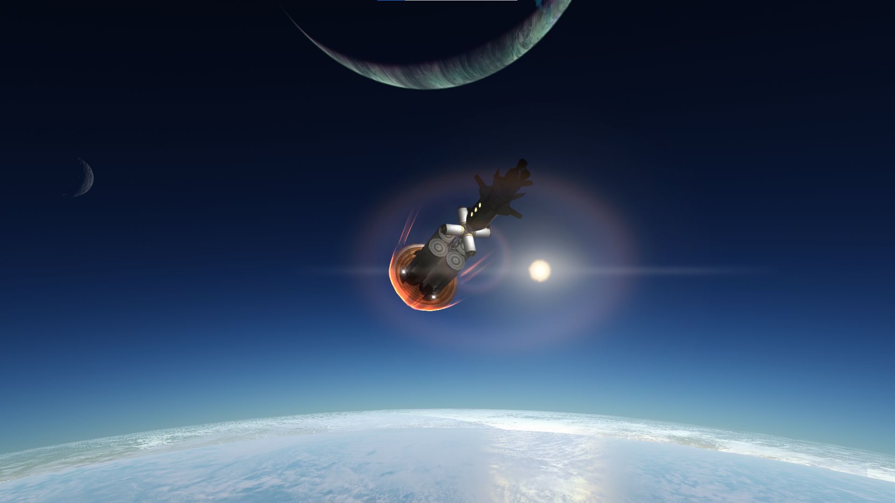
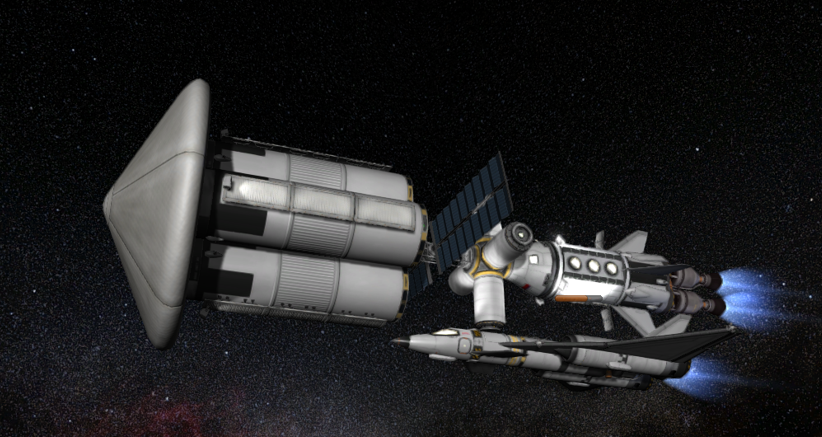

# 星云计划

## 概要

这个计划旨在记录奇异发明和想法，然而它的内容*似乎*不那么接近生活，并且有极高的理论物理和工程学浓度。

目前，本站正完全与[星环计划](https://github.com/AP1028/Ring-of-Stars)完全同步。待其停止维护后，本站将会在目前基础上迅速扩展，包括对每个条目的详细解释。

如果你需要使用此网站的原创概念，请标明出处。本项目使用[Creative Commons Zero v1.0 Universal License](https://github.com/AP1028/ProjectNebula/blob/gh-pages/LICENSE).

如果你有好的点子、发现了实锤的科学性错误或是找到需要改进的地方，请去新建一个[Issue](https://github.com/AP1028/ProjectNebula/issues/new/choose)或[Pull request](https://github.com/AP1028/ProjectNebula/compare)，我会酌情进行修正、添加或是深入研究。

如果你没有GitHub账号，请直接向[tian_yi_xia@qq.com](mailto:tian_yi_xia@qq.com)发送信息。

## 1. 质能转化方式

这里记录了一些从各个地方搜集的质能转化方式。随着文明的发展，利用物质产生能量的效率将会不断提升。

这还说明了一件事：你不能用一千克物质产生超过9×1016焦耳的能量。这个极限无法被科技进步所打破。

ε代表质能转化率，一定物质产生的能量符合E=εmc2

1. **化学能**(火力发电)(*ε=n×10-10%*)
2. **核裂变**(核反应堆，核电站，*ε=0.08%*)
3. **核聚变**(托卡马克/仿星器/Z箍缩/惯性约束)([百度百科](https://baike.baidu.com/item/%E6%A0%B8%E8%81%9A%E5%8F%98)\|[Wikipedia](https://en.wikipedia.org/wiki/Nuclear_fusion)\|[Atomic Rockets](http://www.projectrho.com/public_html/rocket/fusionfuel.php))
   1. **μ子催化聚变**(用μ子替换氘氚之间的共价键，从而在低温低压情况下产生核聚变反应)([百度百科](https://baike.baidu.com/item/%CE%9C%E5%AD%90%E5%82%AC%E5%8C%96%E8%81%9A%E5%8F%98/22755970?fr=aladdin)\|[Wikipedia](https://en.wikipedia.org/wiki/Muon-catalyzed_fusion))
   2. **常规核聚变**(氘-氘、氘-氚、氘-氦3、氦3-氦3、氕-硼11聚变，*0.08%<ε<0.4%*)
   3. **质子聚变**(质子-质子链，将氕聚变为氦4，*ε=0.7%*)
   4. **重核聚变**(非常规型核聚变，包括CNO循环和其他原子序数小于铁的元素的聚变，*0.7%<ε<1%*)
4. **梯级核能反应堆(Ladderdown Reactors)**(一个由科幻小说作家Wil McCarthy假想的将氢分布聚变为铁，从而获得最大聚变能量利用效率的设施，*ε=1%*)([Atomic Rockets](http://www.projectrho.com/public_html/rocket/power.php#ladderdown))
5. **夸克聚变引擎(Sphalerizer)**(由物理学家Max Tegmark提出的通过[Sphaleron过程](https://en.wikipedia.org/wiki/Sphaleron)获得能量的方法，*ε?=50%*)([Wikipedia](https://en.wikipedia.org/wiki/Sphaleron#Energy_release))
6. **彭罗斯过程**(英国物理学家罗杰·彭罗斯所发现的旋转黑洞能量特性，*ε<29%*)([百度百科](https://baike.baidu.com/item/%E5%BD%AD%E7%BD%97%E6%96%AF%E8%BF%87%E7%A8%8B/15613480?fr=aladdin)\|[Wikipedia](https://en.wikipedia.org/wiki/Penrose_process)\|[视频解释](https://www.bilibili.com/video/BV1Ga411A71Z?p=37&share_source=copy_web))
7. **黑洞引力势能**(通过物质在黑洞引力场中落入黑洞的过程汲取引力势能，*ε<42%*)([视频解释](https://www.bilibili.com/video/BV1Qs411L7Qk?share_source=copy_web))
8. **霍金辐射能量引擎**(*ε<90%*)
9. **正反物质湮灭**(*ε<100%*)
10. **理想质能转化引擎**(一个假想的贴近理论极限的质能转化方式，*ε=100%*)

## 2. 航空/宇航推进

这里记录了一些从各个地方搜集和我创造的推进器概念。为了使航天器能拥有足够的效率和适当的推力，需要多样的推进器满足特定的需求。

我并不喜欢那些“曲速引擎”“虫洞”或是“EmDrive”之类的东西。这些东西要么[在逻辑上等同于时间机器](#相对论-超光速因果联系-时间旅行矛盾)，要么干脆直接违反了动量守恒。如果你想看[魔法](#http://www.projectrho.com/public_html/rocket/prelimnotes.php#handwavium)，那么抱歉，你来错地方了。

以下各条目的“*Isp*”代表比冲(Specific Impulse)，是推进器效率的量度，在大小上等于推进器喷出气体的速度除以重力加速度(即Isp=ve/g)。比冲越高，推进器的燃料利用效率越高。然而在推进器输出功率相同下，比冲越高，推力越小。这可以用来解释为什么离子推进器较化学火箭效率极高，推力却小得离谱。

由于Isp不可能大于c/g，这告诉了我们一件事：在不使用[巴萨德冲压发动机](#巴萨德冲压发动机)的情况下，为了将飞船加速到0.9c再减速至零，出发前飞船中燃料占飞船总质量不可能小于95%。这个极限无法通过推进器的科技进步所打破。(很残酷，不是吗？)

1. **化学火箭**(低比冲大推力的化学动力火箭，适用于飞船进入轨道的发射阶段，*500s<Isp<700s*)
2. **核能航空发动机**(利用裂变反应堆加热空气使之膨胀产生推力)([百度百科](https://baike.baidu.com/item/%E6%A0%B8%E8%83%BD%E8%88%AA%E7%A9%BA%E5%8F%91%E5%8A%A8%E6%9C%BA/22108579?fr=aladdin))
3. **核热火箭(NTR)**(NERVA, Lightbulb, 核盐水火箭，利用裂变反应堆加热工质使之膨胀产生推力,*800s<Isp<0.04c/g*)
   1. 
4. **协同吸气式火箭发动机(SABRE)**(一种可以在大气中获取氧气作为氧化剂的火箭发动机，可以减少太空飞机携带的氧化剂，从而使其实现单级入轨)([百度百科](https://baike.baidu.com/item/佩刀吸气式火箭发动机/15639055?fr=aladdin)\|[Wikipedia](https://en.wikipedia.org/wiki/SABRE_(rocket_engine))\|[Reaction Engines 官网](https://www.reactionengines.co.uk/sabre))
5. **协同吸气式核热火箭发动机**(把[核能航空发电机](#核能航空发动机)和[NTR](#NTR)以[SABRE](#SABRE)的方式集成，从而制成更加高效的核动力SABRE)
6. **超导电磁流体推进器**(在导电流体中通过安培力作用产生推力)
7. **蒸汽-流体混合推进器**(类似喷气发动机，通过加热流体至沸腾，产生大量气体，对外膨胀产生推力)
8. **无扇叶电等离子体航空发动机**(用强电场电离并推动空气，通过静态压气机压缩空气，并用大功率微波加热空气至等离子态，最后在电磁线圈的引导下喷出产生推力)
9. **非常规高效化学推进器**(临界态金属氢/自由基结合/亚稳态原子推进器，*1700s<Isp<4300s*)
10. **离子推进器**(低推力高比冲推进器，包括胶质发动机、霍尔效应推进器和VASIMR等推进器，*1000s<Isp<30000s*)([百度百科](https://baike.baidu.com/item/%E7%A6%BB%E5%AD%90%E6%8E%A8%E8%BF%9B%E5%99%A8/4751870?fr=aladdin)\|[Wikipedia](https://en.wikipedia.org/wiki/Ion_thruster))
11. **协同吸气式可变比冲电磁等离子体火箭推进器**(把[无扇叶电等离子体航空发动机](#无扇叶电等离子体航空发动机)和[VASIMR](#离子推进器)以[SABRE](#SABRE)的方式集成，从而制成更加高效的电等离子体SABRE)
12. **核脉冲推进器**(猎户座计划，*3354s<Isp<12000s*)
13. **核聚变推进器**(*50000s<Isp<0.14c/g*）
    1. 磁约束核聚变
    2. **Z箍缩**
    3. 惯性约束核聚变(代达罗斯计划，*Isp=0.035c/g*)
    4. **磁-惯性约束核聚变**(结合了磁约束和惯性核聚变的推进器)
    5. **μ子催化聚变推进器**(在热核聚变小型化前用于小型飞船的聚变推进器)
    6. **质子聚变/重核聚变/梯级核能推进器**(非常规核聚变推进器，*Isp<0.14c/g*)
14. **外燃式电磁等离子体推进器构型**(完全运用电磁场在飞船外对燃料和反应进行操纵，将反应过程完全置于飞船外，通过喷流等离子体与电磁场的作用推动飞船前进。可以避开材料限制，获得极大的功率。这种构型的推进器在运行时看上去就像魔法一样。)
15. **夸克聚变推进器**(利用[夸克聚变引擎](#夸克聚变引擎)能量的推进器，*Isp=0.85c/g*)
16. **微型黑洞火箭推进器**(利用微型黑洞特性进行高效宇航推进)
    1. **霍金辐射型**(*0.2c/g<Isp<0.9c/g*）
    2. **能层工质加速/光子变频型**(利用[彭罗斯过程](彭罗斯过程)提高光子频率)
    3. **类星体喷流型**(利用引力势能，喷流和吸积盘热辐射)
    4. **混合型**(同时或分别使用上述三种推进方式)
17. **反物质推进器**
    1. **π介子工质推进型**(*Isp=0.3c/g*)
    2. **氕氘湮灭**(*Isp=0.94c/g*)
    3. **正负电子光子推进型**(*Isp=1c/g*)
18. **纯质能转化光子火箭推进器**(*Isp=1c/g*)
19. **光帆**(反射太阳光子，依赖光压产生推力)
20. **电帆(E-sail, Electric solar wind sail)**(通过电场偏转太阳风质子获得动量)
21. **巴萨德冲压发动机**(通过超导线圈产生巨大的磁场并用激光束等离子化星际物质，在航行中获取星际物质作为燃料，实现持续不断的加速，从而获得接近光速的飞行速度)
    1. **磁帆(Magnetic Sail)**(用超导线圈产生巨大的磁场最大化星际物质或太阳风对飞船的作用力，从而不用使用自带燃料进行加速，减速，或是航行控制)
       1. **磁帆航行控制系统**(一个用于装有磁帆飞船的空间航行控制系统，使无动力飞船得以只运用星际物质作用力到达目的地，或是作为普通飞船的紧急控制系统，帮助其在主引擎失效时改变航向飞往最近的星系)
       2. **矢量磁帆**(物质进口和喷流方向可以由0°-180°变化的磁帆，有着理论上最大的磁帆航行控制能力)
    2. **电磁等离子体工质反向推力**(使基于[巴萨德冲压发动机](#巴萨德冲压发动机)的推进器在减速过程中通过磁场使等离子体在离开喷口后反向喷出，从而使飞船同时利用[磁帆](#磁帆)和推进器推力，从而获得最大减速推力)
    3. **抛面镜光子反向推力**(类似[电磁等离子体工质反向推力](#电磁等离子体工质反向推力)，通过反射推进器光子喷流获得反推力)
    4. **同轴反转静电磁场发生器**(运用同轴反转驱动带有同量正负电荷的环形结构产生强大的磁场)
    5. **环形等离子磁场发生器**(利用一些电磁部件加速等离子体使之在飞船周围高速运动，产生强大的磁场)
22. **星辰推进器(Star Drive)**(一种集成了[超导电磁流体推进器](#超导电磁流体推进器)、[蒸汽-流体混合推进器](#蒸汽-流体混合推进器)、[协同吸气式可变比冲电磁等离子体火箭推进器](#协同吸气式可变比冲电磁等离子体火箭推进器)、[纯质能转化引擎](#纯质能转化引擎)和[巴萨德冲压发动机](#巴萨德冲压发动机)，配备有[电磁等离子体工质反向推力](#电磁等离子体工质反向推力)和[抛面镜光子反向推力](#抛面镜光子反向推力)，具有调整质量-能量比例改变比冲能力的推进器，可以使飞船高效地实行行星流体/行星大气/行星际/恒星际/跨星系航行，*3000s<Isp<1c/g*)

## 3. 材料合成

1. **理想化学合成器**(化学的尽头，一种自由高效重组原子合成物质的科技)
2. **梯级原子合成器**(原子物理的尽头，拥有将任何元素合成其他元素的能力，原理与[梯级核能反应堆](梯级核能反应堆)类似，但拥有转移能量逆结合能合成元素的能力)
3. **基本粒子重组器**(夸克尺度材料工程的尽头，可以轻易将基本粒子以特定方式组合，制成基于胶子物质的超高强度、耐高温、极高反射率材料)
   1. **胶子弦**(由夸克和胶子组成的弦，有着自然界理论上最强的张力)
   2. **胶子物质**(将夸克和胶子组成的弦经三维定向搭建，从而形成密度适中的超高强度物质)
4. **超弦编译器**(微观物理的尽头，可以随意操纵基本粒子超弦，实现费米子-玻色子互相转换，或是把一种基本粒子转为另一种基本粒子，从而制成一切可以想象的材料)

## 4. “光子朋克”设想

这是一个情景设想，同“蒸汽朋克”类似。

它描述了这样一个情景：如果人类出于某种原因没有将电能作为主要供能方式，而是转而拥抱光学元件、大功率激光和供能光缆，我们身边的事物会发生怎么样的改变？

这么做的最显然好处是从戴森球传输至星球表面的能量无需多次由光能和电能反复转换，从而提高能量传输效率。

然而这么做也有显著问题：激光束不像电路一样容易控制，用家用光路代替家用电路会是个难题。

以下是一些我想到的科技：

1. **光子收集/合并器**(把频率、强度、角度不同的光子以尽量小的损耗转为额定频率下特定强度的激光束)
2. **光子变频/控制器**(把特定频率下特定强度的激光以尽量小的损耗转为所需要的频率和强度)
3. **光热转换器**(将光子射入吸光率极高的物质，或是将光束变频为微波直接加热物体，从而把光能转化为内能)
4. **光气转子**(将光束变频为微波加热特定气体并通过热机带动转子运转，从而将光能转为机械能)
5. **光压转子**(利用反射镜，让光子在定子和转子之间来回碰撞，通过光压把它的全部动量带给转子，从而将光能转为机械能)
6. **光子计算机**(由集成光路，激光器，光学反射镜、透镜、滤波器，光子定向耦合器等元件构成)
7. **“光池”**(将光束困在环状光缆中，从而储存光能)

以上科技充分论证了“光子朋克”的可行性。

然而在现实中，由于[光学物理定律和热力学第二定律的限制](https://what-if.xkcd.com/145)，其可行性存疑。

即使如此，如果能够以这个题材进行科幻相关的创作，我认为会非常有趣。

## 5. 文明发展路径和宇宙工程

**文明发展理论**：一切文明在步入一个特定阶段时都会有如下过程：交通，能量利用，物质物流，整体移动，完全控制。

### 1. I级文明

1. **学会用火**
2. **学会制作工具**
3. **航海与殖民扩张**
4. **认识科学**
5. [**化学能利用**](#化学能)
6. **工业化和城市化**
7. **初级化学材料合成**
8. **质能转化理论基础**
9. [**化学火箭**](#化学火箭)
10. [**核裂变**](#核裂变)
11. **喷气发动机**
12. **大规模航空运用**
13. **近地太空航行**
14. [**核热火箭**](#NTR)
15. [**核裂变脉冲推进器**](#核脉冲推进器)
16. [**离子推进器**](#离子推进器)
17. [**高性能离子推进器**](#离子推进器)(大功率霍尔推进器，VASIMR)
18. [**常规核聚变**](#常规核聚变)
19. **地月系物流系统**(氦3运输)
20. **中级化学材料合成**(高强度材料，碳纳米管)
21. **海上殖民和海底殖民**
22. **人造生态维持系统**
23. **天钩(Skyhook)**([视频解释](https://www.bilibili.com/video/BV1Ga411A71Z?p=9&share_source=copy_web))
24. **电磁轨道弹射器**
25. **行星系规模化物流**(聚变燃料运输为主，小规模殖民为辅)
26. **陆地/海洋大规模环境改造技术**
27. **高级化学材料合成**(超导体，耐高温材料)
28. [**早期核聚变推进器**](#核聚变推进器)(用于高效行星际航行)
29. **全球陆地城市化率趋近100%，海洋改造加速，陆地建筑向着高层发展**
30. **规模化行星际物质运输系统**(在行星间运输大气物质，用来对金星和火星进行环境改造)
31. **大规模行星环境改造和规模化殖民**
32. **太空电梯**
33. **全球陆地海洋总城市化率趋近100%**
34. **气态行星航天港/燃料开采精炼平台**
35. **气态行星太空城**(利用气态行星丰富的核燃料维持的人造居住结构)
36. [**理想化学合成器**](#理想化学合成器)
37. [**高效核聚变推进器**](#核聚变推进器)(用于星际航行)
38. **实验性星际航行**(航行速度：0.01c)
39. **全球能量枢纽**
40. **全球高速物流枢纽**
41. **地球完全被含有人造生态系统的城市覆盖**
42. [**质子聚变**](#质子聚变)
43. **规模化星际航行**(航行速度：0.05c-0.1c)
44. **行星内部大规模殖民/改造**
45. **环赤道粒子对撞机**
46. [**重核聚变**](#重核聚变)
47. **高速星际航行**(航行速度：0.1c-0.15c)
48. **射线接收站**(用于接收[拉格朗日点太阳能发电站](#拉格朗日点太阳能发电站)，[戴森云](#戴森云)，[戴森环](#戴森环)和[戴森壳](#戴森壳)的能量)
49. **拉格朗日点太阳能发电站**(巨大的建于地日拉格朗日点的太阳能发电站，收集的能量与地球受到的总辐射量相当)
50. **环赤道电磁轨道弹射器/大规模行星际物质运输系统**(通过巨大的电磁轨道弹射器和巨大的飞船在行星间运输巨量物质用于建造和利用，并通过线圈的加速和减速循环利用能量，获得和[天钩](#天钩)类似的能量回收能力，从而不用使用火箭推进器进行运输)
51. **“行星工程”**(完全城市化并改造地球陆地，海洋，和内部)
52. **行星发动机**(用于推动行星大小固态物质的推进器，能量来源不限，可使用任何质能转化方式)
53. **气态行星人造殖民地**(与[气态行星太空城](#气态行星太空城)相似，气态行星大气中建造的大规模人造居住结构)
54. **气态行星推进器**([行星发动机](#行星发动机)的衍生技术，原理类似[卡普兰推进器](#卡普兰推进器)，通过直接从气态行星中吸收物质并经过反应产生能量，随后将物质从上下两侧喷出，从而推动气态行星)
55. **行星级飞船**
    1. **行星拖船**
       1. **直接牵引式行星拖船**(一个装有[行星发动机](#行星发动机)，拥有可变形圆形支架的行星级大小的飞船，可直接与行星对接锁定进行拖曳，会不可避免地对行星地表和内部造成极大破坏，因此适用于结构简单，不存在生态系统的行星)
          - **直接牵引式行星星际电磁弹射器**(与[直接牵引式行星拖船](直接牵引式行星拖船)功能类似但用于[环日行星级电磁弹射器](#大规模恒星际物质运输系统)的行星弹射模块)
       2. **直接牵引式气态行星拖船**(一个装有[气态行星推进器](#气态行星推进器)，拥有可变形圆形支架的气态行星大小的飞船，可直接与气态行星对接锁定进行拖曳，从而高效地连续移动多个气态行星。)
       3. **行星引力拖船**(一个月球大小，内部装满核燃料，表面布有[行星发动机](#行星发动机)的飞船，可用自身引力移动行星，并凭借其对行星极其微小的应力使得其表面的地貌和生态系统得以保存)
          1. **“人造太阳”**(一种能量反应装置，可以产生大量光子，从而模拟恒星对行星的光照，使其在行星被[行星引力拖船](#行星引力拖船)移动时维持行星光照)
          2. **行星引力星际电磁弹射器**(与[行星引力拖船](行星引力拖船)功能类似但用于[环日行星级电磁弹射器](#大规模恒星际物质运输系统)的行星弹射模块)
       4. **气态行星引力拖船**(原理类似于[行星引力拖船](#行星引力拖船)，可以推动其他行星，但拥有[气态行星推进器](#气态行星推进器)，凭借其及其多的核燃料储量可以轻易实现高速星系航行)
    2. **行星家园飞船**(一个被极限殖民的星球在内外经过完全改造后拥有了[行星发动机](#行星发动机)和足够的燃料，从而成为了一艘的星际行星飞船)
    3. **气态行星家园飞船**(一个表面被覆盖满人造结构的气态行星飞船，成为文明的殖民中心。其表面装有大量[气态行星推进器](#气态行星推进器)，凭借其及其多的核燃料储量可以轻易长久脱离恒星系独立运行或实现高速星系航行)
    4. **行星级军用飞船**(用于行星尺度战争的行星级飞船)
    5. **“行星重锤”**(一个装有简易[行星发动机](#行星发动机)和控制系统的中小型行星，目的在于迅速变轨撞上目标行星，从而对其实现灾难性的毁灭打击)

### 2. II级文明

[**戴森球计划**](https://baike.baidu.com/item/%E6%88%B4%E6%A3%AE%E7%90%83%E8%AE%A1%E5%88%92/53859183?fr=aladdin)：一款融合了太空、自动化工厂、冒险、探索等元素的科幻题材沙盒建造类游戏。

1. [**“光子朋克”设想**](#“光子朋克”设想)(将文明的能源运作方式从电转为光子，从而避免光能和电能的反复转换，提升能源利用效率)
2. **太阳帆**(戴森云部件，用于操纵太阳辐射)
3. **戴森云**(由众多太阳帆在多条环日轨道上运行构成的戴森球)([百度百科](https://baike.baidu.com/item/%E6%88%B4%E6%A3%AE%E7%90%83/8533395?fr=aladdin)\|[Wiki Mirror](https://ap1028.github.io/wiki-mirror/Dyson_sphere.html#%E6%88%B4%E6%A3%AE%E4%BA%91)\|[Wikipedia](https://en.wikipedia.org/wiki/Dyson_sphere#Dyson_bubble))
4. [**梯级核能反应堆**](#梯级核能反应堆)
5. [**梯级原子合成器**](#梯级原子合成器)
6. **戴森环**(由固体圆环在太阳轨道上运行构成的戴森球)([百度百科](https://baike.baidu.com/item/%E6%88%B4%E6%A3%AE%E7%90%83/8533395?fr=aladdin)\|[Wiki Mirror](https://ap1028.github.io/wiki-mirror/Dyson_sphere.html#%E6%88%B4%E6%A3%AE%E4%BA%91)\|[Wikipedia](https://en.wikipedia.org/wiki/Dyson_sphere#Dyson_swarm))
7. **尼科尔-戴森光束(Nicoll-Dyson Laser)**(恒星级功率激光器，用于摧毁行星，主动式恒星系探测或是星际远程通讯)
8. **反物质制造设施**(将戴森球传输的能量转为反物质储存)
9. [**反物质推进器**](#反物质推进器)
10. **相对论性星际航行**(航行速度：0.3c-0.5c)
11. **环日粒子对撞机/电磁弹射器**(用于基础物理研究，制造[微型黑洞](#微型黑洞)和借由[环赤道电磁轨道弹射器](#环赤道电磁轨道弹射器)的原理把飞船加速至0.3c弹射至目标恒星系)
12. **意识容器**(能够在无机体中储存意识并与外界交互的容器，可由意识体将自我意识转移入其中)
    - [**意识操纵定律**](#意识操纵定律)
13. **非原子材料合成技术**([胶子弦](#胶子弦)，[胶子物质](#胶子物质))
14. [**夸克聚变引擎**](#夸克聚变引擎)
15. [**夸克聚变推进器**](#夸克聚变推进器)
16. **微型黑洞**
    1. **黑洞容器**(一个用于稳定存放高能量霍金辐射黑洞的容器)
    2. [**霍金辐射能量引擎**](#霍金辐射能量引擎)
    3. [**微型黑洞火箭推进器**](#微型黑洞火箭推进器)
    4. **霍金辐射黑洞炸弹**(一个被故意释放的短寿命[微型黑洞](#微型黑洞)，在短时间内产生大量能量并最终爆炸)
    5. **霍金辐射黑洞导弹**(一个由微型可控黑洞容器和短寿命[微型黑洞](#微型黑洞)构成的飞船武器，通过[微型黑洞火箭推进器](#微型黑洞火箭推进器)的原理产生推力航行，并在接近敌舰时使[黑洞容器](#黑洞容器)分离，穿入敌舰内部产生大量能量并最终爆炸，造成巨量破坏)
    6. **微型旋转黑洞变频高能激光器**(运用一连串小黑洞或是微型[彭罗斯球体](#彭罗斯球体)来提高一束激光的能量和频率，从而避开散热问题输出高能激光)
17. **近光速星际航行**(航行速度：0.5c-0.9c)
18. [**巴萨德冲压发动机**](#巴萨德冲压发动机)
19. **实验性跨星系航行**(航行速度：>0.99c)
20. **恒星发动机**(用于移动恒星的装置)([视频解释](https://www.bilibili.com/video/BV1Ga411A71Z?p=5&share_source=copy_web))
    1. **西卡多夫推进器(Shkadov Thruster)**(一个巨大的抛面反射镜，通过反射光子获得光压，通过引力协同推动恒星前进，工程难度类似于戴森壳)([Wikipedia](https://en.wikipedia.org/wiki/Stellar_engine#Class_A_(Shkadov_thruster)))
    2. **卡普兰推进器(Caplan Thruster)**(一个装有能量反应装置和两台巴萨德冲压发动机，借助戴森球的能量获得恒星物质，将物质从上下两个方向喷出射向恒星和星际空间，从而推动恒星前进)([论文](https://sites.google.com/view/m-caplan-stellar-engines/startseite)\|[Wikipedia](https://en.wikipedia.org/wiki/Stellar_engine#Caplan_thruster))
21. **恒星采集器**([卡普兰推进器](#卡普兰推进器)的衍生技术，将吸收的恒星物质进行利用而非直接射入星际空间)([Wikipedia](https://en.wikipedia.org/wiki/Star_lifting))
22. **戴森壳**(完全包裹恒星并完全获取黑洞能量的巨型结构)([百度百科](https://baike.baidu.com/item/%E6%88%B4%E6%A3%AE%E7%90%83/8533395?fr=aladdin)\|[Wiki Mirror](https://ap1028.github.io/wiki-mirror/Dyson_sphere.html#%E6%88%B4%E6%A3%AE%E5%A3%B3)\|[Wikipedia](https://en.wikipedia.org/wiki/Dyson_sphere#Dyson_shell))
23. **戴森壳表面阵列区划开发**(在戴森球表面安装的大功率结构)
    1. **反物质合成阵列**
    2. **物质采集区划**
    3. **材料合成区划**
    4. **大规模量子计算阵列**
    5. **人造居住区划**
24. [**基本粒子重组器**](#基本粒子重组器)
25. **彭罗斯球体**(利用[彭罗斯过程](#彭罗斯过程)通过光子汲取黑洞角动量的巨型结构)([视频解释](https://www.bilibili.com/video/BV1Ga411A71Z?p=37&share_source=copy_web))
    1. **能量利用型**(可控释放黑洞能量)
    2. **脉冲激光型**(效果与[尼科尔-戴森光束](#尼科尔-戴森光束)相同，运用可控脉冲光束释放大量能量)
    3. **黑洞炸弹**(不可控释放黑洞能量，产生接近甚至超过超新星功率的能量输出)
26. **环日行星级电磁弹射器/大规模恒星际物质运输系统**(由行星级直径的环日电磁弹射器构成的物质运输系统，通过发射固态行星和由恒星中开采的大量气团组成的气态行星状物质，凭借[环赤道电磁轨道弹射器](#环赤道电磁轨道弹射器)的能量回收能力，从而高效调整各种天体的组成和质量)
27. **“光晕驱动器(Halo Drive)”星际枢纽**(利用一个自然或人造的黑洞双星系统的引力弹弓效应，采用循环利用光子，将飞船加速到光速的若干分之一，从而实现高效星际航行。极限速度变化大小：1.33*黑洞速度)
28. **黑洞引力势能引擎**(一种利用黑洞明亮吸积盘光能的戴森球，能量来自自然或人为操纵[落入黑洞物质的引力势能](#黑洞引力势能))
    - **黑洞引力势能戴森光束**(类似[尼科尔-戴森光束](#尼科尔-戴森光束)，利用[黑洞引力势能引擎](#黑洞引力势能引擎)的能量产生高能激光束)
29. **恒星级飞船**(恒星尺度的飞船)
    1. **恒星级拖船**
       1. **恒星拖船**(一个集成了戴森壳和卡普兰推进器的巨型飞船，可直接与恒星对接锁定进行拖曳，从而高效地移动恒星)
       2. **白矮星拖船**(一个与[恒星拖船](#恒星拖船)功能类似但运用于白矮星的巨构)
       3. **中子星拖船**(一个与[恒星拖船](#恒星拖船)功能类似但运用于中子星的巨构)
       4. **黑洞拖船**(一个与[恒星拖船](#恒星拖船)功能类似但运用于黑洞的巨构)
          1. **彭罗斯黑洞光子推进环**(通过[彭罗斯球体](#彭罗斯球体)类似的原理产生可控大功率光子束，把黑洞的角动量转化为黑洞的动量)
          2. **冲压式彭罗斯黑洞推进环**([彭罗斯黑洞光子推进环](#彭罗斯黑洞光子推进环)的改进型，运用[巴萨德冲压发动机](#巴萨德冲压发动机)获取工质，从而显著提高加速度)
       5. **恒星引力拖船**(类似[行星引力拖船](#行星引力拖船)，表现为一艘大推力小型[恒星级飞船](#恒星级飞船)，可以通过自身引力牵引任何天体)
          - **恒星引力星系际电磁弹射器**(类似[行星引力星际电磁弹射器](#行星引力星际电磁弹射器)但用于恒星大小的天体)
       6. **恒星星系际电磁弹射器**(类似[直接牵引式行星星际电磁弹射器](#直接牵引式行星星际电磁弹射器)但用于恒星大小的天体)
    2. **恒星家园飞船**(类似[行星家园飞船](#行星家园飞船)，拥有[戴森壳](#戴森壳)和其表面高度发达的[阵列区划](#戴森壳表面阵列区划开发)，且配备[恒星发动机](#恒星发动机)的巨型飞船)
    3. **恒星级军用飞船**(用于恒星尺度战争的恒星级飞船)
       1. **恒星军用飞船**(装有[恒星拖船](#恒星拖船)，[尼科尔-戴森光束](#尼科尔-戴森光束)和武器的恒星飞船，其表面覆盖有一层厚厚的恒星物质作为防御手段)
       2. **黑洞军用飞船**(携有[黑洞拖船](#黑洞拖船)、[脉冲激光型彭罗斯球体](#脉冲激光型)和[黑洞引力势能戴森光束](#黑洞引力势能戴森光束)的军用黑洞飞船，有着较弱的电磁辐射特征，有一定的电磁隐身能力，可以穿插入敌方舰队进行引力干扰和进行火力支援)
       3. **“行星抛射器”**(一个装有[恒星发动机](#恒星发动机)或[恒星级拖船](#恒星级拖船)的中小型天体，目的在于迅速变轨进入敌方恒星系从而扰乱行星轨道。)
       4. **"白矮星炸弹"**(一个装有简易[白矮星拖船](#白矮星拖船)或[恒星引力拖船](#恒星引力拖船)且接近钱德拉塞卡极限的人造白矮星。通过撞击目标或是用[恒星引力拖船](#恒星引力拖船)受控撞击白矮星，产生Ia型超新星爆发，从而对恒星级目标实现灾难性的毁灭打击)

### 3. III级文明

1. **恒星级“种子”文明扩展装置**(一个被派往其他恒星系的机器，目的在于从零开始在这个恒星系中建造[戴森球](#戴森壳)、[恒星级拖船](#恒星级拖船)等设施，并自我复制飞往更多临近星系重复这个过程)
2. [**理想质能转化引擎**](#理想质能转化引擎)
3. [**纯质能转化光子火箭推进器**](#纯质能转化光子火箭推进器)
4. [**超弦编译器**](#超弦编译器)
5. **实用化星系际航行**(航行速度：相对论系数γ>200)
6. **环星系粒子对撞机/环星系电磁天体弹射器**(一个围绕星系的巨型结构，可以用于研究基础物理或拥有类似[环赤道电磁轨道弹射器](#环赤道电磁轨道弹射器)的功能，把特定天体加速到接近光速并甩向中央黑洞，并用黑洞做引力辅助改变轨道平面，使其驶向目标星系，从而实现高效星系际航行和物质物流运输)
7. **星系超大质量黑洞可控吸积能量引擎**(以星系中心的超大质量黑洞为核心，通过在其周围建造[黑洞引力势能引擎](#黑洞引力势能引擎)，并用[恒星级拖船](#恒星级拖船)、[大规模恒星际物质运输系统](#大规模恒星际物质运输系统)和电磁线圈结构将物质输入黑洞附近，可控地在黑洞附近形成吸积盘，使黑洞产生超过全星系的能量输出功率并获得接近[夸克聚变](#夸克聚变引擎)的质能转化效率)
8. **星系超大质量黑洞可控吸积发动机**(以星系中心的超大质量黑洞为核心，通过在其周围建造[黑洞引力势能引擎](#黑洞引力势能引擎)，并用[恒星级拖船](#恒星级拖船)、[大规模恒星际物质运输系统](#大规模恒星际物质运输系统)和超导电磁线圈结构将物质输入黑洞附近，可控地在黑洞附近形成吸积盘，并用一个巨大的由引力固定于黑洞的巨型结构罩住黑洞南北两极，在其中一极安置由巨型超导电磁线圈组成的磁喷口控制黑洞喷流，在另一极[安置特定巨型超导电磁线圈使黑洞的喷流方向被逆转](#电磁等离子体工质反向推力)，从而促使黑洞可控地像一个方向喷出相对论性喷流，使得其能通过人造结构推动整个星系)
9. **星系超大质量黑洞戴森光束**(类似[尼科尔-戴森光束](#尼科尔-戴森光束)，可以对小于等于星系大小的目标进行杀伤或是星系间通讯)
10. **星系级飞船**(文明将整个星系资源集成的杰作，通过人造结构储存各种星系中的天体和物质，用[星系超大质量黑洞可控吸积能量引擎](#星系超大质量黑洞可控吸积能量引擎)获得能量，用[星系超大质量黑洞可控吸积发动机](#星系超大质量黑洞可控吸积发动机)获得移动的能力，从而使其可以控制整个星系的资源和在星系群中的移动方向)
    - **星系电磁高速运输网络**(一个连接[星系级飞船](星系级飞船)内部，长度达几十万光年的电磁运输网络，可以持续加速其中的飞船或物质运输结构至及其接近光速，从而高效连接其内部各个部分)

### 4. IV级文明

1. **星系级“种子”文明扩展装置**(一个被派往其他星系的机器，目的在于从零开始在这个星系中的所有恒星系建造[戴森球](#戴森壳)、[恒星级拖船](#恒星级拖船)等设施，并通过这些设施建造[星系级飞船](#星系级飞船)，最后自我复制飞往更多临近星系重复这个过程)
2. **宇宙物质运输系统**(类似[大规模恒星际物质运输系统](#大规模恒星际物质运输系统)，但尺度与可见的宇宙相当，主要目的在于对抗宇宙膨胀带来的物质损失，将宇宙边缘的物质转为光子束或相对论性离子束射向宇宙中心)

## 6. 宇宙作战理论

**!!! 注意：本条目尚不完善。**

### 概念

1. **“星理”情报**(对于作战星系天体质量、位置和轨道参数的情报，其认知程度会影响作战时的武器弹道精确度。正因如此，恒星尺度下的宇宙作战通常有主场优势)
2. **引力干扰/压制**(类比现代空战中的电磁干扰，用黑洞军用飞船或是双黑洞引力干扰设施对敌方施加预料之外的引力场，从而影响敌方机动能力和武器精度)
3. **“制引力权”**(对敌方压倒性的引力干扰能力，造成全范围武器精度/航向影响，从而为己方提供作战优势)

### 1. 飞船尺度

主体对象：通常被称为“飞船”的事物，大小由战斗机至城市大小不等。

#### 1. **攻击性武器**

1. **舰载无人机**(携带有武器的无人飞船，用于近距攻击)
2. **激光武器**(用激光的能量击穿敌舰船体，在不成熟时有极大的散射问题和散热问题)
   1. **电激光器**(将飞船反应堆的电能转为光能，发热严重)
   2. **光子激光器**(将反应堆的光子经过光学仪器操纵后产生的大功率激光)
   3. **微型旋转黑洞变频高能激光器**(运用一连串小黑洞或是微型[彭罗斯球体](#彭罗斯球体)来提高一束激光的能量和频率，从而避开散热问题输出高能激光)
3. **动能武器**(利用弹丸的动能造成伤害，通常由轨道炮发射)
4. **导弹**(一种制导方式，可以在飞行途中通过火箭推进器进行轨道修正从而提高命中率)
5. **核弹/反物质弹**(高能质能转化武器，只有直接命中才能产生大量伤害)
6. **等离子物质抛射弹**(包裹有特定物质的核弹/反物质弹，产生大量飞溅的等离子体从而对周围的飞船造成伤害)
7. **粒子束武器**(质子束、中子束、α粒子束、电子束)
8. **等离子束线圈炮**(一个修改过的火箭推进器，用能量反应后聚合高温等离子体喷流进行杀伤，射程较短)
9. **等离子脉冲炮**(一个修改过的脉冲火箭推进器，用能量反应后聚合高温等离子体脉冲进行瞬时杀伤，射程较短)
10. **静电示踪弹**(用于探测敌方飞船偏导力场的作用效果从而获得偏导力场的情报，提高等离子/粒子束武器和动能武器的有效性)
11. **线圈示踪弹**(用于探测敌方飞船电磁偏导力场的作用效果从而获得偏导力场的情报，提高等离子/粒子束武器和动能武器的有效性)
12. **智能电磁场制导弹**(一种末端制导手段，通过特定电磁场抵消电磁偏导力场的偏转效果，从而提高准确度)
13. **近距μ子束炮**(一种特殊的粒子束武器，目的在于命中装有惯性约束核聚变推进器飞船的燃料库，引发μ子催化聚变，从而在内部对敌舰产生大量伤害)
14. **霍金辐射黑洞炸弹**(一个被故意释放的短寿命[微型黑洞](#微型黑洞)，在短时间内产生大量能量并最终爆炸)
15. **霍金辐射黑洞导弹**(一个由微型可控黑洞容器和短寿命[微型黑洞](#微型黑洞)构成的飞船武器，通过[微型黑洞火箭推进器](#微型黑洞火箭推进器)的原理产生推力航行，并在接近敌舰时使[黑洞容器](#黑洞容器)分离，穿入敌舰内部产生大量能量并最终爆炸，造成巨量破坏)

#### 2. **防御性手段**

1. **静电偏导力场**(可以防御等离子/粒子束武器)
2. **电磁偏导力场**(可以防御等离子/粒子束武器，并能和动能武器弹头的金属部件发生作用从而影响其准确性)
3. **铅版**(用于防御粒子束武器)
4. **点防御系统**(应对来袭动能武器、导弹和无人机的防御系统)
   1. **动能点防御**(用轨道炮的弹射物撞击来袭弹丸使其偏离轨道)
   2. **激光点防御**(用激光气化部分弹丸使其因气体气化的推进效应偏离轨道)
   3. **导弹点防御**(用大量导弹命中各个目标摧毁来袭弹丸)
5. **气体云**(拥有极其巨大的折射率，可以防御激光武器并降低敌方命中精度)
6. **装甲/船体**(飞船的最后一道防线)

### 2. 行星尺度

主体对象：行星级军用飞船，大小由小行星至木星大小不等。

#### 1. **攻击性武器**

1. **舰载近距攻击飞船**(一些从行星级军用飞船上起飞的舰载机至城市大小的飞船，可以迅速机动至敌方行星级飞船附近，对其表面实施侦察或是对特定部件如[行星发动机](行星发动机)和[环赤道电磁轨道弹射器](#环赤道电磁轨道弹射器)进行精准打击)
2. 千米级动能武器
   1. [**环赤道电磁轨道弹射器**](#环赤道电磁轨道弹射器)
3. 千米级动力制导系统
4. 千米级核武器(完全摧毁行星当量<半径为17km的氢弹)
5. 千米级反物质武器(完全摧毁行星当量<半径为2.5km的反物质弹)
6. 长距大功率激光武器

#### 2. 防御性手段

1. 极其厚的岩石层
2. 极其厚的大气
3. 千米级点防御系统

### 3. 恒星尺度

主体对象：恒星级军用飞船，大小由褐矮星至天狼星不等。

(更大的飞船因为内部结构不稳定，难以拥有实战价值)

#### 1. **攻击性武器**

1. **恒星军用飞船**(装有[恒星拖船](#恒星拖船)，[尼科尔-戴森光束](#尼科尔-戴森光束)和武器的恒星飞船，其表面覆盖有一层厚厚的恒星物质作为防御手段)
2. 舰载行星级飞船
3. 行星级动能武器
   1. [**环日行星级电磁弹射器**](#大规模恒星际物质运输系统)
4. 行星级动力制导系统
   1. [**“行星重锤”**]("行星重锤")
5. 行星级反物质武器(完全摧毁恒星当量<半径为2700km的反物质弹)
6. [**尼科尔-戴森光束**](#尼科尔-戴森光束)(作为恒星级军用飞船的主能量武器)
7. "白矮星炸弹"
8. **黑洞军用飞船**(携有[黑洞拖船](#黑洞拖船)、[脉冲激光型彭罗斯球体](#脉冲激光型)和[黑洞引力势能戴森光束](#黑洞引力势能戴森光束)的军用黑洞飞船，有着较弱的电磁辐射特征，有一定的电磁隐身能力，可以穿插入敌方舰队进行引力干扰和进行火力支援)
9. 双黑洞引力干扰设施(一个人造的旋转双黑洞，对星系内天体施加引力震荡，从而达成引力干扰)
10. 等离子团示踪弹(对黑洞武器的反制手段，可以将其射向黑洞的大致区域，通过等离子团受到潮汐力变形的形态推测出黑洞武器所在位置)

#### 2. 防御性手段

1. 极其厚的等离子体表面
2. 冗余戴森区划
3. 行星级点防御
   1. [**尼科尔-戴森光束**](#尼科尔-戴森光束)(作为对抗来袭行星级动能武器的能量点防御系统)

### 4. 星系尺度

主体对象：整个星系/星系级飞船

#### 1. 攻击性武器

1. 舰载恒星级飞船
   1. "白矮星炸弹"
2. [尼科尔-戴森光束阵列](#尼科尔-戴森光束)
3. 星系超大质量黑洞戴森光束

#### 2. 防御性手段

1. **人造星云**(用于散射高能激光束和对动能武器和制导武器施加阻力，影响能量武器、动能武器和制导武器精度和射程)

## 7. 奇异的构想

这里记录了所有非太空/宇宙相关的奇特构想

### 1. 工程设想

1. **FusionOS**(一种假想的可以兼容全平台的操作系统，同时兼容Windows, Linux, macOS, Android, iOS, FreeBSD......)

2. **微立方模块化芯片制造**(一种假想的芯片制造方法，通过制造无数基本立方电路元件，像搭积木一样把元件粘合在一块，从而在三维空间内制造电路)

3. **处理器冗余加速**(一种假想的处理器加速方法，通过降压升频用稳定性换性能，再用多组处理器或多个核心互相纠错补偿稳定性)

4. **气垫球**(一个像气垫导轨像各个方向喷气的球，可以依赖地面效应悬浮于地面，有奇特的受力反馈，非常好玩。)

5. **同温层天文/大气观测站**(一个假想的项目，通过微型飞艇携带望远镜、气压仪、星链天线、太阳能板、涵道风扇等设备至平流层，从而得以长期停留于平流层并进行星空和云层观测)

6. **“曙光号”多用途飞船**(一艘配备有[星辰推进器](#星辰推进器)，具有流线型外形的小型载人飞船，能轻易在银河系内以1g左右的加速度自由地航行，加速到接近光速，造访各个行星。这个项目的目的在于在科学允许的前提下实现小时候曾经对于太空旅行和飞船的最为纯粹的梦想。)

7. **风灵号轨道器**(一艘我在[坎巴拉太空计划(KSP)](https://baike.baidu.com/item/%E5%9D%8E%E5%B7%B4%E6%8B%89%E5%A4%AA%E7%A9%BA%E8%AE%A1%E5%88%92/7596160?fr=aladdin)中设计的有趣的飞船，可以通过大气制动节省燃料)

   

   发射载具

   

   

   飞跃Kerbin

   大气制动

   

   携带Aeris4A核动力改进型太空飞机

7. **土星滑翔机**(一种假想的可以稳定在气态行星低层大气低速巡航的太空飞机，可以帮助拍摄土星夜间极其壮观的图片)
8. **可扩展性医用机械外骨骼**(一种用于医疗辅助的微型机械外骨骼)
9. **生物分子电力供能器**(一种假想的用电能维持人体生物循环的设备)
10. **通用纳米技术核心模块**(一种假想的高级文明用来组成科技设备的基本单位，可以自由地进行编程和重组从而从而将一种科技转为另一种科技)
11. **微型惰性气体托卡马克模拟装置**(一个装有电磁线圈的托卡马克模型，内部充有惰性气体，在运行时可以观察到惰性气体通电发光和被约束的过程)
12. **小型飞船缆绳式人工重力解决方案**(用缆绳和可分离配重块最大化飞船居住舱和重心的距离，从而使小型飞船可以实现人工重力)
13. **相对论性μ子存储线圈**(通过将μ子加速到接近光速从而延长其衰变所需要的时间，进而实现μ子长时间存储从而实现μ子催化聚变)
14. **根式单向加密**(由考试用991计算器猜答案的过程可知，如果对一个数进行含有加减乘除和开根的运算，很难猜出原数是什么，因此这个原理可用于加密)
15. **电磁雨伞**(一个神奇的没有伞面的微型雨伞，原理类似[巴萨德冲压发动机](#巴萨德冲压发动机)，可以发射激光等离子化雨滴并用磁场将其偏转，从而阻止伞下的人淋到雨)
16. **蚊虫点防御**(运用三维成像系统和大功率激光，从而高效击落那些尝试在你大腿上进行俯冲轰炸的蚊子)
17. **开源物理可视化框架(Open Physics Visualization Framework, OPVF)**(一个开源物理引擎计划，旨在渲染出符合物理的图像和结构，从而用于科幻作品)

### 2. 规律和定律

1. **宇宙巨型结构效能扩展定律**(假设对于巨型结构，1单位体积通过使用1单位功率可以在1单位时间内产生1单位功效，那么由于体积限制，巨构会先在三维方向扩展；当遇到散热瓶颈后，巨构会在二维片状扩展；当巨构的半径接近史瓦西半径时，巨构会转为一维条状扩展，防止自身变成一个黑洞)
2. **意识操纵定律**(这是一个和意识有关的哲学-物理猜想，可以用于研究和科幻设定。意识，作为一种状态，和量子态有着相似的性质。它不能被完全复制，只能从某种形式转移至另一种形式。若不满足上述性质，意识的复制本身会导致主观感受发生重叠的悖论。任何和意识发生交互或储存意识的装置必须满足在物理层面上禁止违反以上规律的操作，才能拥有合理存在的可能性。)
3. **宇宙临界参数定律**(在我们宇宙的物理结构中，所有的物理常数似乎都恰恰满足生命存在的条件。对于理论物理，这可以被用来反思特定物理概念和常数的意义)
4. **逆向宇宙研究方式**(运用[宇宙临界参数定律](#宇宙临界参数定律)的方法并把其运用于物理结构上，寻找维持生命存在的必要物理结构，作为理论物理研究的方向)
5. **费米悖论-无机星球猜想**(这是对于费米悖论的其中一个解释的衍生猜想，即由于存在生物性的自我复制机器自然产生极其困难，很多宜居星球会类似原始地球，拥有与地球相似的空气构成，海洋、大陆、山脉、天气、水循环、板块活动，但是表面光秃秃的没有任何植被，甚至连基本的单细胞生物都没有。殖民这样一颗行星虽然比殖民火星、金星容易，但是仍需要从零开始引入完整的生态系统。)
6. **文明扩张定律**(文明在发展过程中会趋向于先开发容易得到的空间和资源，使得在大规模向外发展只会受到当下资源紧张的情况下才会发生)
7. **文明危机**(文明在发展过程中可能陷入的危机，导致文明发展停滞)
   1. **生物：化学极乐**(一个有机体文明充分掌握了自身身体的奖励反馈机制，用自动化设备建造全自动生物反应装置，使得每个个体都会在出生后终身困在生物化学装置中，不断享受生物快感直到生命的终结，从而永远终结了文明的进一步发展。)
   2. **虚拟：意义丢失**(一个文明破解了意识的意义，将所有个体的意识上传入了意识容器构成的虚拟空间内。然而，对虚拟世界的掌控代表他们拥有了彻底改写自身目的和追寻意义的内容。若操作不当，所有虚拟个体很可能满足于虚拟空间的生活，失去了对扩张的欲望和对意义的追寻。)
8. **黑洞时间流逝-霍金辐射悖论/困惑**(如果在观察者视角掉入黑洞时间流逝加快，那么能否做到在掉入奇点前由于时间流逝趋于无限加速，使得观察者直接加速至黑洞因霍金辐射而完全蒸发的时间段，从而得以不被黑洞摧毁?)
9. **文明发展理论**(一切文明在步入一个特定阶段时都会有如下过程：交通，能量利用，物质物流，整体移动，完全控制)
10. **“种子”文明扩展装置故障**(一个特定情景，如果哪个“种子”文明扩展装置发生故障，成为独立于原文明的敌对实体，导致其无视已正常发展的星系不受控扩张，产生类似[灰蛊风暴](https://baike.baidu.com/item/grey%20goo/282719?fr=aladdin)的灾难性结果)
11. **相对论-超光速因果联系-时间旅行矛盾**(如果有一个设施能够相对一个惯性参照系建立超光速因果联系，由于相对论的存在，“同时”的概念在不同惯性参照系下是不同的。若我们使用特定近光速参照系观察此事件，就会发现因果联系由时间逆向传递，构成时间机器。因此，无论超光速设施运行是否需要相对论参与，<u>任何超光速的因果传递都在逻辑上等于时间机器</u>。)

### 3. 瞎扯

1. **宇宙盲盒**(这是一个盲盒，里面装着全宇宙随机30cm x 30cm x 30cm区域的东西，你会得到什么呢？)
2. **魔法核聚变**(难道奇奇怪怪的东西不能发生核聚变吗？)
3. **中子星化学理论**(中子星只不过是大号原子核罢了，那么中子星就*一定*可以组成分子并发生化学反应)

